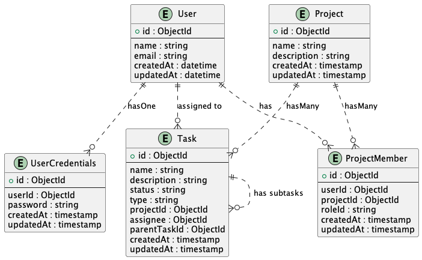
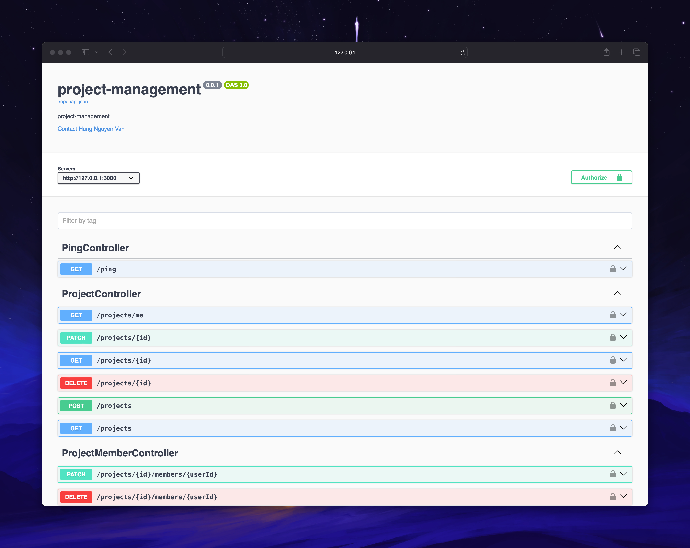

# Project Management

## Introduction

This is a project management backend api that allows users to create projects, assign roles to users, and assign tasks to users.

## Technologies

- Node.js for runtime
- LoopBack 4 for API framework
- TypeScript for language
- MongoDB for database
- JWT for authentication
- Docker & Docker Compose for containerization
- VSCode for IDE
- Vagrant for deployment
- Ngrok for exposing the application to the internet
- PM2 for process management

## Features

- User management
  - CRUD operations
  - Using JWT for authentication/authorization
- Project management
  - Projects CRUD operations
  - Project Members CRUD operations with roles (Admin, Developer, Tester, ...)
    - Only project members can view project details
    - Only project admins can modify project
  - Project Tasks CRUD operations with task types (public, private)
    - Only project admins can view and modify all tasks (public and private)
    - Other project members can view and modify public tasks

## ERD



## Build and run

### Prerequisites

- Node.js 18.x
- Docker

### Run Locally

- Clone the project

```sh
git clone https://github.com/vanhung4499/project-management-api
```

- Install dependencies

```sh
yarn install
```

- For the mongoDB, you can run local mongo or use the docker-compose to run the database instance

```sh
docker-compose up -d mongo
```

- Copy the `.env.example` file to `.env`

```sh
cp .env.example .env
```

- Run the migration to create the database schema

```sh
yarn run premigrate
yarn run migrate
```

- Run the application

```sh
yarn start
```

Open http://127.0.0.1:3000 in your browser.

### Run with Docker

I have already created a Dockerfile and docker-compose.yml file for you to run the application in a container. You can build and run the application with the following commands:

```sh
docker-compose up -d
```

### Other useful commands

- `yarn run build`: Build the application
- `yarn run rebuild`: Force a full build by cleaning up cached artifacts
- `yarn run lint`: Lint the code
- `yarn run lint:fix`: Lint the code and fix issues
- `yarn run migrate`: Migrate database schemas for models
- `yarn run openapi-spec`: Generate OpenAPI spec into a file
- `yarn run docker:build`: Build a Docker image for this application
- `yarn run docker:run`: Run this application inside a Docker container
- `yarn run docker:compose`: Run this application and a MongoDB instance with Docker Compose


## API Documentation

After running the application, you can access the API documentation at http://localhost:3000/explorer.



## Deployment

For now, i can't deploy the application to the cloud because of my account. So, i deploy to an VM instance on my local machine.
The deployment process is as follows:
- Use Vagrant to create a VM instance
- Use Vagrant Provisioning:
  - Instal and setup mongodb, nodejs, pm2, ngrok
  - Clone the project from github
  - Install dependencies
  - Run the application with pm2
  - Expose the application to the internet with ngrok

For more information, you can see the Vagrantfile in the root directory.

## License

Distributed under the MIT License. See `LICENSE` for more information.

## References

- [LoopBack 4 Documentation](https://loopback.io/doc/en/lb4/)
- [MongoDB Documentation](https://docs.mongodb.com/)
- [JWT Documentation](https://jwt.io/introduction/)
- [Docker Documentation](https://docs.docker.com/)
